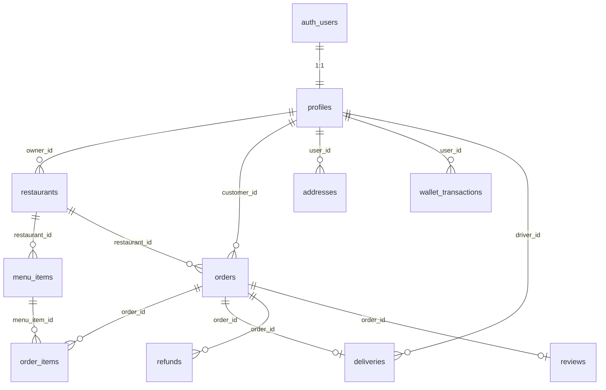

# Deligro — Database Reference

Quick reference for the **Supabase (Postgres)** schema used by the Next.js app.  
Source of truth: [`supabase/migrations/`](../supabase/migrations/) (`0001` → `0007`).

---

## Connection

| Env variable | Purpose |
|--------------|---------|
| `NEXT_PUBLIC_SUPABASE_URL` | Project URL |
| `NEXT_PUBLIC_SUPABASE_PUBLISHABLE_KEY` or `NEXT_PUBLIC_SUPABASE_ANON_KEY` | Browser + RLS-enforced server reads |
| `SUPABASE_SECRET_KEY` or `SUPABASE_SERVICE_ROLE_KEY` | Server-only scripts (bypasses RLS) |

- **Dashboard:** Supabase → your project → Table Editor / SQL Editor  
- **Live counts in app:** `/build`  
- **Never commit** `.env.local`

---

## Enums

| Enum | Values | Used in |
|------|--------|---------|
| `user_role` | `customer`, `restaurant`, `driver`, `admin` | `profiles.role` |
| `order_status` | `placed`, `kitchen`, `ready`, `on_the_way`, `delivered`, `cancelled` | `orders.status` |
| `delivery_status` | `unassigned`, `assigned`, `picked_up`, `delivered`, `cancelled` | `deliveries.status` |
| `refund_status` | `pending`, `approved`, `denied` | `refunds.status` |

### Order status flow (vendor / driver / customer)

```
placed → kitchen → ready → on_the_way → delivered
   ↘ cancelled (vendor or admin)
```

| Legacy PHP status | Supabase `order_status` |
|-------------------|-------------------------|
| ORDER PLACED | `placed` |
| ORDER PROCESSED | `kitchen` |
| ORDER PICKED UP | `on_the_way` |
| ORDER DELIVERED | `delivered` |
| ORDER CANCELED | `cancelled` |

---

## Entity relationship (overview)



---

## Tables

### `auth.users` (Supabase Auth — not in `public`)

Managed by Supabase Auth. Each row gets a matching `profiles` row via trigger `on_auth_user_created`.

| Field (common) | Notes |
|----------------|-------|
| `id` | UUID — same as `profiles.id` |
| `email` | Login email |
| `phone` | Optional; used for OTP login |

---

### `profiles`

One row per authenticated user. **`role` is the authorization source of truth.**

| Column | Type | Default | Notes |
|--------|------|---------|-------|
| `id` | `uuid` PK | — | FK → `auth.users(id)` ON DELETE CASCADE |
| `role` | `user_role` | `customer` | Only admin/service-role can change (trigger `lock_role`) |
| `full_name` | `text` | null | |
| `phone` | `text` | null | Unique when set (partial index) |
| `wallet_balance` | `numeric(10,2)` | `0` | Added in `0006` |
| `onesignal_id` | `text` | null | OneSignal player id for push (`0007`) |
| `created_at` | `timestamptz` | `now()` | |

**RLS:** User reads/updates own row; admin reads all.

**App roles → routes**

| `role` | Portal |
|--------|--------|
| `customer` | `/`, `/checkout`, `/orders` |
| `restaurant` | `/vendor`, `/vendor/menu`, `/vendor/earnings` |
| `driver` | `/driver` |
| `admin` | `/admin` |

---

### `restaurants`

A shop / restaurant listing. Vendor account = `profiles` where `role = 'restaurant'` and `restaurants.owner_id = profiles.id`.

| Column | Type | Default | Notes |
|--------|------|---------|-------|
| `id` | `uuid` PK | `gen_random_uuid()` | |
| `owner_id` | `uuid` | — | FK → `profiles(id)` |
| `slug` | `text` UNIQUE | — | URL: `/restaurant/[slug]` |
| `name` | `text` | — | Display name |
| `tagline` | `text` | null | |
| `is_open` | `boolean` | `true` | Vendor toggle (`/vendor` header) |
| `approved` | `boolean` | `false` | Must be true for customer browse (unless owner) |
| `image_url` | `text` | null | Cover image (`0002`) |
| `accent_tint` | `text` | null | CSS gradient fallback |
| `cuisines` | `text[]` | `{}` | e.g. `{"Fast Food","North Indian"}` |
| `rating` | `numeric(2,1)` | `4.5` | |
| `rating_count` | `integer` | `0` | |
| `eta_min` | `integer` | null | Minutes |
| `eta_max` | `integer` | null | Minutes |
| `price_tier` | `smallint` | `2` | 1 = ₹, 2 = ₹₹, 3 = ₹₹₹ |
| `cost_for_two` | `integer` | null | Whole rupees |
| `distance_km` | `numeric(4,1)` | null | |
| `offer` | `text` | null | Promo line on card |
| `promoted` | `boolean` | `false` | Home feed boost |
| `created_at` | `timestamptz` | `now()` | |

**Indexes:** `owner_id`

**Legacy PHP mapping:** `shop` table → `restaurants`  
**Legacy slug pattern:** `shop-name-{legacy_shop_id}` e.g. `burger-republic`, `chhitiz-swad-restaurant-126`

**RLS:** Customers read `approved = true`; owners read/manage own rows; admin all.

**DAL:** [`src/lib/data-access/restaurants.ts`](../src/lib/data-access/restaurants.ts), [`vendor-restaurant.ts`](../src/lib/data-access/vendor-restaurant.ts)

---

### `menu_items`

| Column | Type | Default | Notes |
|--------|------|---------|-------|
| `id` | `uuid` PK | `gen_random_uuid()` | |
| `restaurant_id` | `uuid` | — | FK → `restaurants(id)` |
| `name` | `text` | — | |
| `description` | `text` | null | |
| `price` | `integer` | — | **Whole rupees** (₹), ≥ 0 |
| `veg` | `boolean` | `true` | |
| `available` | `boolean` | `true` | `false` = sold out on customer UI |
| `external_id` | `text` | null | Legacy import id e.g. `legacy-260` |
| `category` | `text` | null | e.g. `Burgers`, `Popular` |
| `image_url` | `text` | null | |
| `popular` | `boolean` | `false` | |
| `bestseller` | `boolean` | `false` | |
| `sort_order` | `integer` | `0` | Vendor display order (`0009`) |
| `created_at` | `timestamptz` | `now()` | |

**Unique:** `(restaurant_id, external_id)` where `external_id` is not null

**Storage:** public bucket `menu-images` — object path `{restaurant_id}/{filename}`; owners write via `owns_restaurant()` (`0009`)

**Legacy PHP mapping:** `products` → `menu_items` (`status ON/OFF` → `available`)

**RLS:** Public read for approved restaurants; owner CRUD via `owns_restaurant()`.

**DAL:** [`vendor-menu.ts`](../src/lib/data-access/vendor-menu.ts)

---

### `orders`

| Column | Type | Default | Notes |
|--------|------|---------|-------|
| `id` | `uuid` PK | `gen_random_uuid()` | |
| `customer_id` | `uuid` | — | FK → `profiles(id)` |
| `restaurant_id` | `uuid` | — | FK → `restaurants(id)` |
| `status` | `order_status` | `placed` | See enum flow above |
| `total` | `integer` | `0` | **Server-computed** (items + fees), ≥ 0 |
| `delivery_fee` | `integer` | `0` | Whole rupees (`0002`) |
| `tax_amount` | `integer` | `0` | Whole rupees (`0002`) |
| `address` | `jsonb` | null | See shape below |
| `pickup_otp` | `text` | random 4-digit | Restaurant handover (`0006`) |
| `delivery_otp` | `text` | random 4-digit | Rider handover (`0006`) |
| `created_at` | `timestamptz` | `now()` | |

**`address` JSON shape**

```json
{
  "label": "Home",
  "line": "Koramangala 5th Block, Bengaluru"
}
```

Optional `lat` / `lng` may be added from map picker.

**Indexes:** `customer_id`, `restaurant_id`

**RLS:** Customer own orders; restaurant own `restaurant_id`; driver assigned active delivery; admin all.

**DAL:** [`orders.ts`](../src/lib/data-access/orders.ts), [`vendor-orders.ts`](../src/lib/data-access/vendor-orders.ts), [`admin-orders.ts`](../src/lib/data-access/admin-orders.ts)

**Vendor board filters:** `status IN ('placed','kitchen','ready')` for active kitchen columns.

---

### `order_items`

Line items snapshotted at order time (price/name frozen even if menu changes).

| Column | Type | Default | Notes |
|--------|------|---------|-------|
| `id` | `uuid` PK | `gen_random_uuid()` | |
| `order_id` | `uuid` | — | FK → `orders(id)` CASCADE |
| `menu_item_id` | `uuid` | null | FK → `menu_items(id)` SET NULL |
| `name` | `text` | — | Snapshot |
| `qty` | `integer` | — | > 0 |
| `price` | `integer` | — | Unit price snapshot, whole rupees |

**Index:** `order_id`

**RLS:** Visibility follows parent order.

---

### `deliveries`

One delivery row per order (1:1).

| Column | Type | Default | Notes |
|--------|------|---------|-------|
| `id` | `uuid` PK | `gen_random_uuid()` | |
| `order_id` | `uuid` UNIQUE | — | FK → `orders(id)` |
| `driver_id` | `uuid` | null | FK → `profiles(id)` |
| `status` | `delivery_status` | `unassigned` | |
| `assigned_at` | `timestamptz` | null | |
| `delivered_at` | `timestamptz` | null | |

**Index:** `driver_id`

**DAL:** [`driver-orders.ts`](../src/lib/data-access/driver-orders.ts)

---

### `refunds`

| Column | Type | Default | Notes |
|--------|------|---------|-------|
| `id` | `uuid` PK | `gen_random_uuid()` | |
| `order_id` | `uuid` | — | FK → `orders(id)` |
| `amount` | `integer` | — | Whole rupees |
| `reason` | `text` | null | |
| `status` | `refund_status` | `pending` | |
| `decided_by` | `uuid` | null | FK → `profiles(id)` admin |
| `created_at` | `timestamptz` | `now()` | |

**RLS:** Customer request + read own; admin approve/deny.

---

### `addresses`

Saved customer delivery addresses.

| Column | Type | Default | Notes |
|--------|------|---------|-------|
| `id` | `uuid` PK | `gen_random_uuid()` | |
| `user_id` | `uuid` | — | FK → `profiles(id)` |
| `label` | `text` | `'Home'` | e.g. Home, Work |
| `line` | `text` | — | Full address string |
| `lat` | `double precision` | null | |
| `lng` | `double precision` | null | |
| `is_default` | `boolean` | `false` | Only one default per user (trigger) |
| `created_at` | `timestamptz` | `now()` | |

**API:** `GET/PATCH/DELETE /api/addresses`, `POST /api/addresses`

---

### `reviews`

| Column | Type | Default | Notes |
|--------|------|---------|-------|
| `id` | `uuid` PK | `gen_random_uuid()` | |
| `order_id` | `uuid` UNIQUE | — | One review per order |
| `user_id` | `uuid` | — | FK → `profiles(id)` |
| `restaurant_id` | `uuid` | — | FK → `restaurants(id)` |
| `rating` | `integer` | — | 1–5 |
| `comment` | `text` | null | |
| `created_at` | `timestamptz` | `now()` | |

**RLS:** Public read; customer insert only on own **delivered** order.

**API:** `POST /api/reviews`

---

### `wallet_transactions`

| Column | Type | Default | Notes |
|--------|------|---------|-------|
| `id` | `uuid` PK | `gen_random_uuid()` | |
| `user_id` | `uuid` | — | FK → `profiles(id)` |
| `amount` | `numeric(10,2)` | — | Positive = credit, negative = debit |
| `reason` | `text` | — | |
| `order_id` | `uuid` | null | FK → `orders(id)` |
| `created_at` | `timestamptz` | `now()` | |

**RLS:** User read own; writes are **service-role only** (client cannot credit self).

---

### `coupons`

| Column | Type | Default | Notes |
|--------|------|---------|-------|
| `code` | `text` PK | — | e.g. `WELCOME50` |
| `kind` | `text` | — | `percent` or `flat` |
| `value` | `numeric(10,2)` | — | % or flat ₹ amount |
| `min_order` | `numeric(10,2)` | `0` | Minimum cart |
| `max_discount` | `numeric(10,2)` | null | Cap for percent coupons |
| `active` | `boolean` | `true` | |
| `expires_at` | `timestamptz` | null | |
| `created_at` | `timestamptz` | `now()` | |

**Seed coupons:** `WELCOME50`, `FLAT30` (in migration `0006`)

**API:** `POST /api/coupons/validate`

---

### `otp_codes`

Server-only OTP storage for phone login. **No RLS policies** — only service-role can access.

| Column | Type | Default | Notes |
|--------|------|---------|-------|
| `id` | `uuid` PK | `gen_random_uuid()` | |
| `phone` | `text` | — | E.164 e.g. `+919876543210` |
| `code_hash` | `text` | — | `sha256(code + phone + pepper)` |
| `attempts` | `integer` | `0` | Lock after too many wrong tries |
| `consumed` | `boolean` | `false` | |
| `expires_at` | `timestamptz` | — | |
| `created_at` | `timestamptz` | `now()` | |

**API:** `POST /api/auth/otp/request`, `POST /api/auth/otp/verify`

---

## Helper functions (Postgres)

| Function | Purpose |
|----------|---------|
| `owns_restaurant(rid uuid)` | True if `auth.uid()` owns the restaurant |
| `is_admin()` | True if current profile role is `admin` |
| `is_active_driver_for(oid uuid)` | Driver can see order while delivery active |
| `recompute_order_total(oid uuid)` | `total = sum(items) + delivery_fee + tax_amount` |
| `current_role()` | Returns `profiles.role` for `auth.uid()` |

---

## Row Level Security (summary)

| Table | Customer | Restaurant | Driver | Admin |
|-------|----------|------------|--------|-------|
| `profiles` | own | own | own | all |
| `restaurants` | read approved | own CRUD | — | all |
| `menu_items` | read approved menus | own CRUD | — | all |
| `orders` | own CRUD insert | own restaurant | assigned active | all |
| `order_items` | via order | via order | via order | via order |
| `deliveries` | — | read own restaurant | own assignment | all |
| `refunds` | request own | — | — | decide |
| `addresses` | own CRUD | — | — | — |
| `reviews` | insert delivered | read | read | read |
| `coupons` | read active | read active | read active | service-role manage |
| `wallet_transactions` | read own | read own | read own | service-role write |
| `otp_codes` | **none** (service only) | | | |

---

## Legacy PHP → Supabase mapping

| Legacy MySQL (`deligro-php`) | Supabase table | Notes |
|------------------------------|----------------|-------|
| `shop` | `restaurants` | `status ON/OFF` → `is_open` |
| `products` | `menu_items` | `status ON/OFF` → `available` |
| `category` | `menu_items.category` | Category name as text |
| `orders` | `orders` | **Not fully imported yet** — only new app orders |
| `user` | `profiles` + `auth.users` | Customers imported via `db:import-legacy-customers` |
| `shop.email` / `shop.phone` | vendor `auth.users` | `db:import-legacy-owners` |

---

## Useful scripts

```bash
npm run db:seed-users          # Demo vendor/driver/admin accounts
npm run db:seed                # Seed catalog from src/lib/data.ts (6 demo restaurants)
npm run db:import-legacy       # Import legacy shops + menu from JSON export
npm run db:import-legacy-owners # Link each shop to a vendor auth account
npm run db:import-legacy-customers
```

**Demo vendor login:** `vendor@deligro.demo` / `DeligroDemo1!` (owns 6 seed restaurants — use header dropdown on `/vendor`)

---

## Common SQL snippets

**Count everything**

```sql
select
  (select count(*) from profiles) as profiles,
  (select count(*) from restaurants) as restaurants,
  (select count(*) from menu_items) as menu_items,
  (select count(*) from orders) as orders;
```

**Orders for one restaurant**

```sql
select o.id, o.status, o.total, o.created_at
from orders o
join restaurants r on r.id = o.restaurant_id
where r.slug = 'burger-republic'
order by o.created_at desc;
```

**Menu for one restaurant**

```sql
select m.name, m.price, m.category, m.available
from menu_items m
join restaurants r on r.id = m.restaurant_id
where r.slug = 'burger-republic'
order by m.category, m.name;
```

**Who owns a restaurant**

```sql
select r.name, r.slug, p.full_name, p.role, u.email
from restaurants r
join profiles p on p.id = r.owner_id
join auth.users u on u.id = p.id
where r.slug = 'burger-republic';
```

---

## App code map

| Feature | Data access file | API route |
|---------|------------------|-----------|
| Customer catalog | `src/lib/data-access/restaurants.ts` | — |
| Place order | `src/lib/data-access/orders.ts` | `POST /api/orders` |
| Vendor kitchen board | `src/lib/data-access/vendor-orders.ts` | `PATCH /api/orders/[id]/status` |
| Vendor menu toggle | `src/lib/data-access/vendor-menu.ts` | `PATCH /api/vendor/menu/[id]/availability` |
| Vendor earnings | `src/lib/data-access/vendor-earnings.ts` | — |
| Driver board | `src/lib/data-access/driver-orders.ts` | `src/app/driver/actions.ts` |
| Admin orders | `src/lib/data-access/admin-orders.ts` | — |
| Build page stats | `src/lib/data-access/build-stats.ts` | — |

---

## Money & types convention

- **All prices in DB are whole rupees** (`integer`) unless noted (`numeric` for wallet/coupons).
- **App UI** uses `formatINR()` from `src/lib/utils/format.ts`.
- **IDs** are UUIDs in Postgres; UI shows short codes via `shortOrderId()`.

---

## Migrations order

| File | What it adds |
|------|----------------|
| `0001_init.sql` | Core tables, enums, RLS, triggers |
| `0002_catalog_display.sql` | Restaurant/menu display fields, order fees |
| `0003_lock_role_service_bypass.sql` | Seed scripts can set roles |
| `0005_phone_otp.sql` | `otp_codes` table |
| `0006_customer_features.sql` | Addresses, OTP on orders, reviews, wallet, coupons |
| `0007_push_onesignal.sql` | `profiles.onesignal_id` |

---

*Last generated from migrations in-repo. Re-run `/build` or query Supabase for live row counts.*
